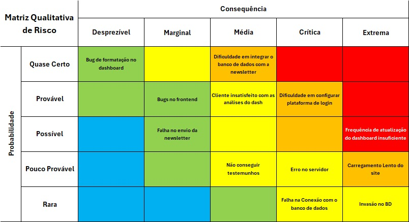
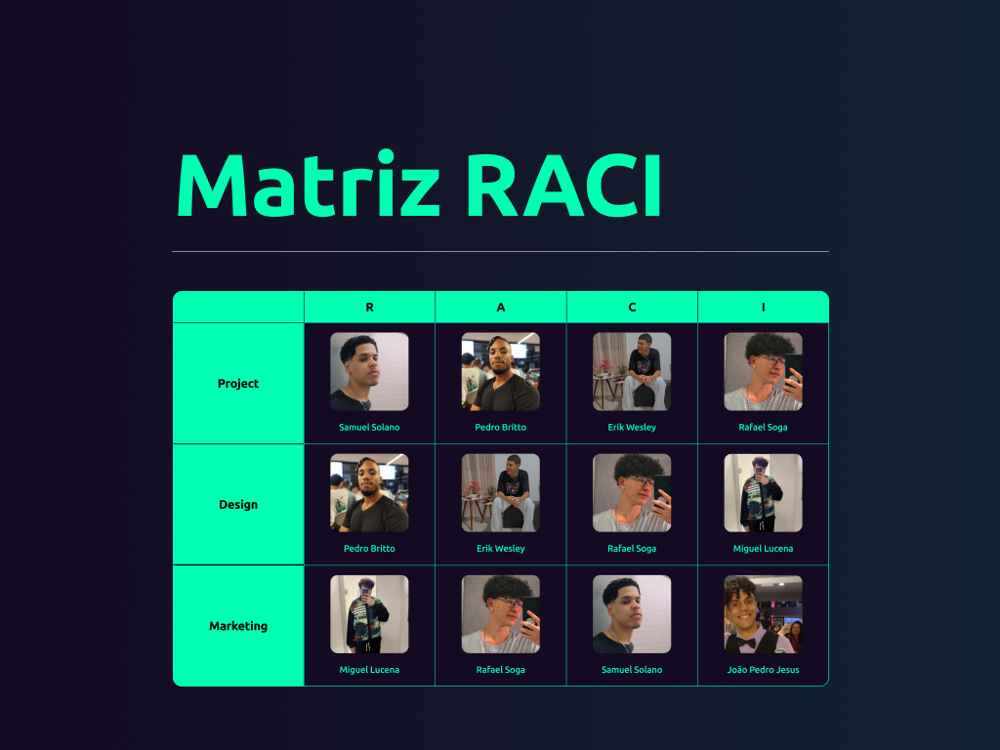
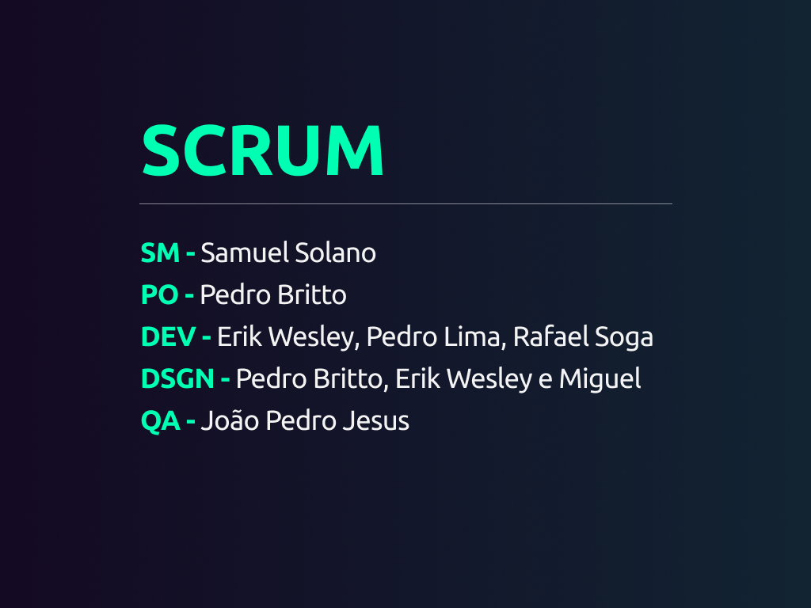
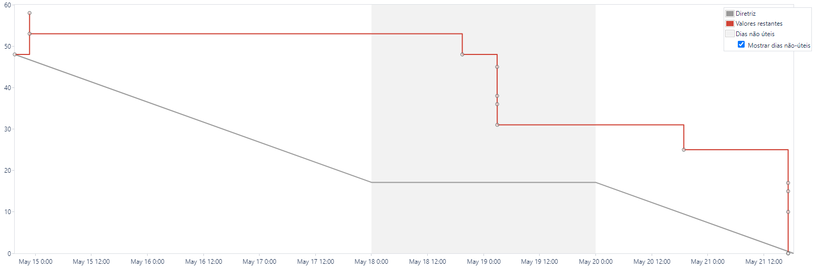
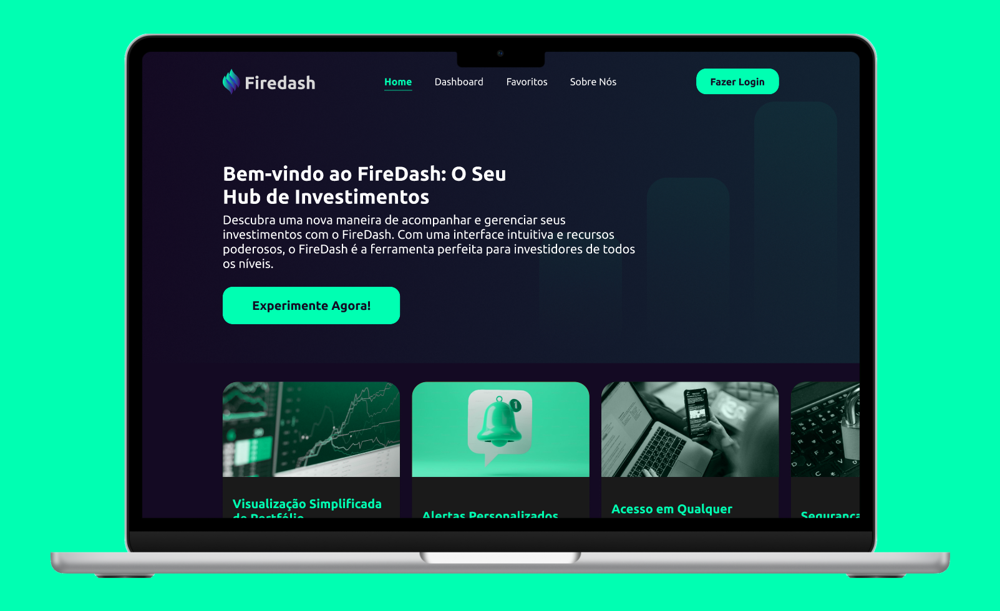
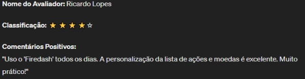
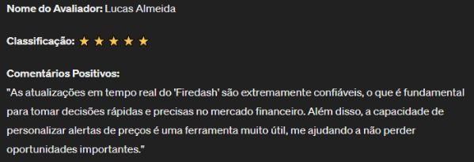
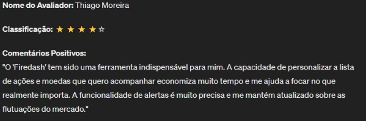
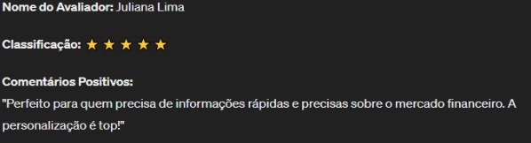
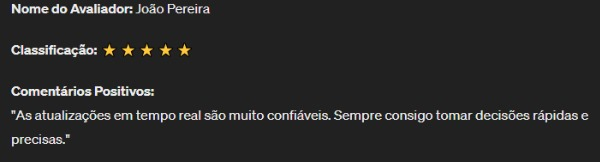

# Sobre Nós

### Integrantes
- Erik Wesley Pereira do Nascimento - R.A.: **86489**
- João Pedro de Jesus Narcizo - R.A.: **100006**
- Miguel Lucena Ady dos Santos - R.A.: **100088**
- Pedro de Oliveira Britto - R.A.: **96029**
- Pedro Henrique Lima de Brito - R.A.: **103465**
- Rafael Pansica Soga - R.A.: **98790**
- Samuel Solano Neres - R.A.: **96037**

O Firedash é uma plataforma que fornece dashboards de análise do mercado de ações, projetados para auxiliar investidores com insights acionáveis. Nossa missão é **democratizar o acesso ao mercado financeiro**, fornecendo ferramentas avançadas de análise de maneira acessível e intuitiva.

Fazemos parte da VCPC Holding, uma organização impulsionada pela **inovação e excelência em investimentos**. Composta por sete sócios visionários, a VCPC Holding pretende atuar em diversas áreas sempre inovando através da tecnologia.

No Firedash, combinamos expertise em análise financeira com **tecnologia de ponta** para oferecer aos nossos clientes uma visão abrangente do mercado de ações. Nossa equipe é apaixonada por fornecer **insights valiosos** e ajudar nossos usuários a tomar decisões informadas e estratégicas.

Se você está buscando entender melhor o mercado de ações e otimizar seus investimentos, o Firedash é o seu parceiro confiável. Junte-se a nós e liberte o seu potencial de investimento.

# Objetivos do Projeto:

-   Desenvolver uma interface de usuário intuitiva e responsiva para fácil navegação e utilização.
    
-   Integrar fontes de dados confiáveis para fornecer informações precisas e atualizadas sobre ações, fundos, ETFs e outros tipos de investimentos.
    
-   Implementar recursos de análise poderosos, como gráficos interativos, relatórios personalizados e alertas automatizados.
    
-   Priorizar a segurança dos dados dos usuários, adotando as melhores práticas de criptografia e proteção de informações.
    
-   Oferecer suporte multiplataforma, permitindo acesso ao FireDash a partir de dispositivos desktop e móveis.
    
-   Criação de Landing page responsiva com um resumo sobre o projeto.

## Matriz de Risco

## Matriz RACI

## Scrum Team

## Burndown Chart

O burndown chart foi feito no Jira, para acessar o projeto [Clique aqui](https://samuesolano.atlassian.net/jira/software/c/projects/VCPC/boards/1/backlog)

## Protótipo Figma

[Acesse o Protótipo](https://www.figma.com/design/oUEKnigQu0d8IoD0tN7dva/Firedash?node-id=0%3A1&t=5qiNm5c8tnQCta1C-1)

# Landing page

A Landing Page do Firedash é projetada para atrair e engajar potenciais usuários, fornecendo uma visão clara e convincente dos benefícios da nossa plataforma. Com um design atraente, conteúdo informativo e uma chamada para ação convincente, esperamos converter visitantes em clientes satisfeitos. O programa roda essencialmente usando o bootstrap como ferramenta principal mas utilizamos diversas ferramentas como gulp, webpack e sass.

## Banner Principal

**Título:** Bem-vindo ao FireDash: O Seu Hub de Investimentos

**Descrição:** Descubra uma nova maneira de acompanhar e gerenciar seus investimentos com o FireDash. Com uma interface intuitiva e recursos poderosos, o FireDash é a ferramenta perfeita para investidores de todos os níveis.

**CTA:** Experimente Agora!

## Recursos Principais

Visualização de Portfólio: Tenha uma visão clara e organizada de todos os seus investimentos em um só lugar.

Análise de Desempenho: Analise o desempenho dos seus investimentos ao longo do tempo com gráficos interativos e relatórios personalizados.

Alertas Personalizados: Configure alertas automatizados para ficar por dentro de eventos importantes relacionados aos seus investimentos.

## Depoimentos de Clientes

# Dashboard

O Dashboard do Firedash é uma ferramenta poderosa para acompanhar e analisar investimentos, oferecendo uma interface intuitiva e funcionalidades avançadas. Com o uso de Python, Pandas e Streamlit, desenvolvemos uma solução eficaz para ajudar os investidores a tomarem decisões informadas e otimizarem seus portfólios.

## Tecnologias Utilizadas

O Dashboard do Firedash foi desenvolvido utilizando as seguintes tecnologias:

**Python:** A linguagem de programação principal para o desenvolvimento do backend do dashboard.

**Pandas:** Uma biblioteca Python para manipulação e análise de dados, utilizada para processar e preparar os dados de investimento.

**Streamlit:** Uma biblioteca Python para a criação de aplicativos web interativos, utilizada para desenvolver a interface de usuário do dashboard.

## Funcionalidades Principais

O Dashboard do Firedash oferece as seguintes funcionalidades principais:

**Visualização de Portfólio:** Os usuários podem visualizar seus portfólios de investimentos de forma clara e organizada, incluindo informações sobre os ativos, alocações e desempenho.

**Análise de Desempenho:** Os usuários podem analisar o desempenho de seus investimentos ao longo do tempo, utilizando gráficos interativos e métricas de retorno.
 
**Comparação de Ativos:** Os usuários podem comparar o desempenho de diferentes ativos dentro de seus portfólios, facilitando a tomada de decisões de investimento.
 
**Alertas Personalizados:** Os usuários podem configurar alertas personalizados para serem notificados sobre eventos importantes relacionados aos seus investimentos, como mudanças significativas de preço.
